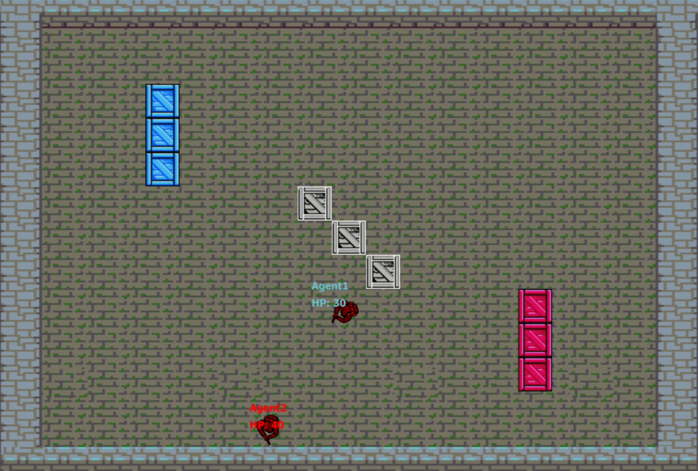

# ECE 493 Capstone Project: Code-to-Kill



Code-to-Kill is a programming-based game created to help players learn and practice coding.
The game involves players controlling their agents by writing code snippets with API functions provided in the game, and the objective of the game is very simple: Eliminate the opponents agent by any means possible.
Once the players have entered their code, the game is run and a player is crowned victorious based on the outcome of the game.

This project was created for the course ECE 493 at the University of Alberta.
This is the capstone project course for the Computer Engineering (Software Option) program.

## Authors
- Toluwani Adekunle: https://github.com/ad3kunl3
- Michael Boivert: https://github.com/mrboisvert
- May Shukla: https://github.com/mayshukla

## Installation

1. Ensure that Python 3 and pip are installed on your system. On linux, this can be done using the distribution’s package manager. Our code was tested against Python version 3.7 and above.

1. Clone repo

```bash
git clone https://github.com/mayshukla/ece493-capstone.git
cd ece493-capstone
```

1. Install python requirements

```bash
python3 -m pip install -r src/requirements.txt
```

1. Start server.

```bash
python3 -m src <port>
```

## Playing the Game

1. Go to `localhost:<port>` in a web browser.
   Make sure to use the same port that you passed as an argument when starting the server.
   The browser window should say "Waiting in matchmaking queue."

1. Open a second browser window to `localhost:<port>`.
   Now, both windows should show text input boxes labelled "Class Name:" and "Your code:"
   There should also be a button at the bottom of the page labelled "Submit Code".

1. In each browser window, you must enter valid Python code and click "Submit Code".
   Your code must include Python class that extends `Agent`.
   The name in the "Class Name:" box must match the name of the agent class that you want to be executed.
   For documentation on the Agent class open the file `doc/Agent.html` in a web browser.
   To see examples of Agent classes, see the directory `test/agent_code`.

1. If there is a syntax error in your code, the error will be printed in red text after the submit button is clicked.
   You may edit your code and click the button again to resubmit.

1. Once valid code has been submitted in both browser windows, the game will begin.
   Both windows should show the game running in real time.
   The name of each agent class and its health (out of 100) will be shown next to the agent.
   When an agent performs an attack, it will flash green.
   When an agent takes damage, it will flash red.

1. The game will end when at least one agent reaches zero health.
   If an agent still has non-zero health, it will be declared the winner.
   If both agents reach zero health at the same time, the game will be declared a tie.
   When the game ends, each browser window will display the results of the game.

## Running tests

1. Follow the first three steps under "Installation" to clone the repo and install python requirements.

1. Install a recent version of Chromium on your machine.
   This can be done on linux using your distro's package manager.
   Otherwise, see <https://www.chromium.org/getting-involved/download-chromium/>.
   This is required since we use the selenium webdriver for chromium to test the frontend.

1. Install additional python requirments for tests.
```
python3 -m pip install -r test/requirements.txt
```

1. Run the following in the root directory of this repo.

```
python3 -m unittest
```

1. To run the tests with Chromium in headed mode:

```
GUI=1 python3 -m unittest
```

## Sprites and Spritesheets

All sprites were obtained from the following links below under the CC-BY 3.0 and OGA-BY 3.0 licenses

https://www.dlf.pt/pngsn/47299/
https://opengameart.org/content/frostcrest-props-crates-nes
https://opengameart.org/content/animated-top-down-survivor-player
https://github.com/kittykatattack/learningPixi/blob/master/examples/images/dungeon.png
